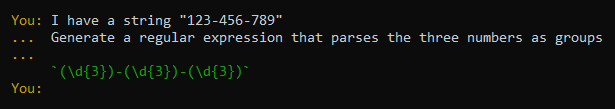

# ChatGPT Command Line Interface

Enables access to the ChatGPT model via the command line using
[transitive-bullshit/chatgpt-api](https://github.com/transitive-bullshit/chatgpt-api) package.



## Installation

On Windows, make sure to add the project directory to your PATH variable to access the `gpt` command from anywhere.  
I do not own a mac/linux, so I used ChatGPT to transform the `.bat` file to a `.sh` file, so don't expect it to
necessarily work. Please open an issue if it does not, and if you have a file that works on Mac/Linux.

### with clone

```bash
git clone https://github.com/YanWittmann/gpt-cmd
cd gpt-cmd
npm install
```

### without clone

```bash
npm install
```

## Usage

You can optionally pass an initial text by specifying it as argument:

```bash
gpt <text>
```

In any case, the interactive mode will be activated, and you can type your text in the console.

- Enter a (multiline) prompt and press `Enter` twice to generate a response
- `Ctrl+C`, `exit`, `quit` to exit
- `reset` to reset the conversation
- `cp`, `copy` to copy the last response to the clipboard
- `info`, `help` to display a message similar to this one
